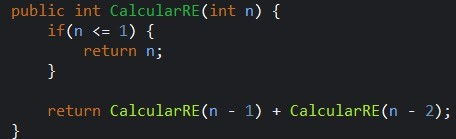
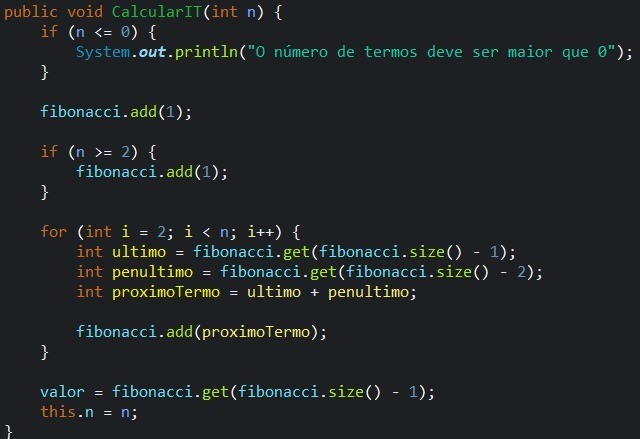
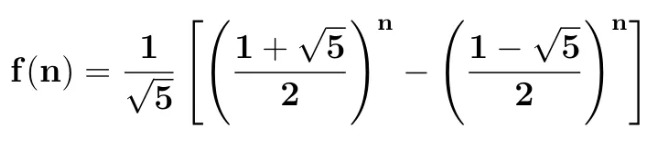
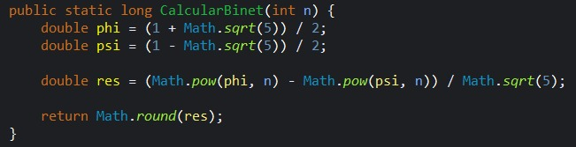
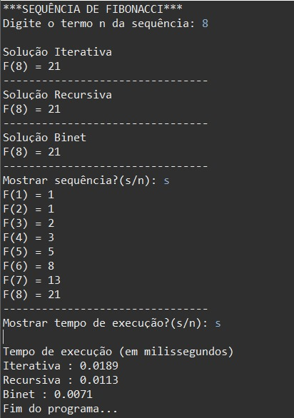

# Atividade Fibonacci - 23/09

### Usando recursão

Aquela relação de recorrência é traduzida para uma função recursiva — isto é, uma função que “chama a si própria” — sem muito esforço. Uma possível definição da função Fibonacci em Java seria:

Havendo compreendido o raciocínio matemático por trás disso, essa solução é muito mais limpa e legível, se encaixa muito bem em Java. Observe que, da forma como está escrito aí, cada chamada da função irá chamar outras duas funções, o que pode ser um problema.

---

### Solução Iterativa

Um algoritmo iterativo seria basicamente aquele que possui a estrutura de repetição, como o for. Esta seria a forma mais “normal” de se programar um comportamento repetitivo.

À primeira vista, parece que ficou mais robusto e longo em relação ao recursivo.

---

### Fórmula de Binet

Esta terceira abordagem oferece uma solução direta e elegante, eliminando a necessidade de estruturas de repetição ou recursão. É baseada na fórmula de Binet, que permite o cálculo de qualquer termo da sequência de Fibonacci de forma fechada.

O que em Java seria:

Apesar da legibilidade do código estar visivelmente degradada e ser muito difícil de customizar futuramente esse algoritmo, essa versão é extremamente previsível, fácil de testar, veloz e possível de ser comprovada matematicamente.

Problemas da fórmula de Binet:

<ul>
    <li>O tipo decimal float tem problemas de precisão que atrapalharão a eficácia;</li>
    <li>A presença de um número irracional é um perigo à eficácia;</li>
    <li>Os cálculos de raiz quadrada e potenciação talvez atrapalhem a eficiência.</li>
</ul>

Apesar disso, a acurácia desse algoritmo continua aceitável. Até a precisão se tornar um problema, o tamanho do tipo inteiro na memória já teria estourado antes.

---

### Análise de Matemática 

| Algoritmo | Complexidade de Tempo | Complexidade de Espaço | Observação |
|---|---|---|---|
| Recursivo | O(2^n) | O(n) | Ineficiente para n > 40 |
| Iterativo | O(n) | O(n) | Mais rápido, mas precisa guardar toda a lista |
| Binet | O(1) | O(1) | Instantâneo, mas pode ter erros de precisão em n grandes |

---

<h4>Análise Empírica</h4>
<h4>Tempos de Execução (em milisegundos)</h4>
<table class="performance-table">
    <thead>
        <tr>
            <th>N</th>
            <th>Iterativa</th>
            <th>Recursiva</th>
            <th>Binet</th>
        </tr>
    </thead>
    <tbody>
        <tr>
            <td>10</td>
            <td>0.0288</td>
            <td>0.0453</td>
            <td class="binet">0.0083</td>
        </tr>
        <tr>
            <td>20</td>
            <td>0.0383</td>
            <td>0.178</td>
            <td class="binet">0.0094</td>
        </tr>
        <tr>
            <td>30</td>
            <td>0.0439</td>
            <td class="recursiva">7.6597</td>
            <td class="binet">0.0327</td>
        </tr>
        <tr>
            <td>40</td>
            <td>0.053</td>
            <td class="recursiva">485.0371</td>
            <td class="binet">0.0169</td>
        </tr>
        <tr>
            <td>50</td>
            <td>0.0936</td>
            <td class="recursiva">4839.2023</td>
            <td class="binet">0.0229</td>
        </tr>
    </tbody>
</table>

Foram realizados testes no código Java para n-ésimo = 10, 20, 30, 35, 40.
Os tempos variam conforme o computador, mas seguem a mesma tendência.

Ao implementar os algoritmos de Fibonacci em diferentes linguagens, é possível perceber características distintas que influenciam no desenvolvimento e desempenho: Python, C++, Java.

Python é excelente para rapidez no desenvolvimento e clareza de código, mas pode ter desempenho menor em aplicações que exigem muita performance. A C++ é a melhor opção quando a performance máxima é prioridade, mesmo que o código seja mais difícil de escrever. Java equilibra desempenho, portabilidade e segurança, sendo ideal para sistemas grandes e multiplataforma.

<h3 class="text-xl font-bold mt-6 mb-2">Links dos repositórios:</h3>
            <ul class="list-disc list-inside space-y-1">
                <li><strong class="font-bold">Java</strong>: <a href="https://github.com/kayquevo/FibonacciFAM" class="text-blue-600 hover:underline">https://github.com/kayquevo/FibonacciFAM</a></li>
                <li><strong class="font-bold">Python</strong>: <a href="https://github.com/stabilegustavo/fibonacci" class="text-blue-600 hover:underline">https://github.com/stabilegustavo/fibonacci</a></li>
                <li><strong class="font-bold">C++</strong>: <a href="https://github.com/kayquevo/fibonacciC" class="text-blue-600 hover:underline">https://github.com/kayquevo/fibonacciC</a></li>
            </ul>

---

### 🖥️ Leitura no console

---
### Referencias

    Furtado, D. A. (s.d.). Módulo 7 - Introdução à Análise de Algoritmos. [PDF]. Disponível em: <a href="https://furtado.prof.ufu.br/site/teaching/ED1/ED1-07-Introducao-Analise-Algoritmos.pdf">https://furtado.prof.ufu.br/site/teaching/ED1/ED1-07-Introducao-Analise-Algoritmos.pdf</a>

    Marcell Guilherme C. da Silva. Analisando computacionalmente a Sequência de Fibonacci. 2018. Medium.
    Disponível em: <a href="https://medium.com/@marcellguilherme/analisando-computacionalmente-a-sequ%C3%AAncia-de-fibonacci-9aded34b2fb6">https://medium.com/@marcellguilherme/analisando-computacionalmente-a-sequ%C3%AAncia-de-fibonacci-9aded34b2fb6</a>

    DevMedia. Sequência de Fibonacci em Java. 2012. 
    Disponível em: <a href="https://www.devmedia.com.br/sequencia-de-fibonacci-em-java/23620">https://www.devmedia.com.br/sequencia-de-fibonacci-em-java/23620</a>

    Matemática com Cristiano Marcell. A FÓRMULA PARA DETERMINAR QUALQUER TERMO DA SEQUÊNCIA FIBONACCI. 2021. YouTube. 
    Disponível em: <a href="https://www.youtube.com/watch?v=rF4VGqwSTLc">https://www.youtube.com/watch?v=rF4VGqwSTLc</a>

    GUJ - Java Users' Group. Medir o tempo de execução de um método. 
    Disponível em: <a href="https://www.guj.com.br/t/medir-o-tempo-de-execucao-de-um-metodo/34531">https://www.guj.com.br/t/medir-o-tempo-de-execucao-de-um-metodo/34531</a>

    GeeksforGeeks. Fibonacci Sequence. 
    Disponível em: <a href="https://www.geeksforgeeks.org/maths/fibonacci-sequence/">https://www.geeksforgeeks.org/maths/fibonacci-sequence/</a>

    Cormen, T. H., Leiserson, C. E., Rivest, R. L., & Stein, C. (2009). Introduction to Algorithms. Algoritmos: Teoria e Prática. 3. ed. Rio de Janeiro: Elsevier, 2012.

    Python Software Foundation. Python 3 Documentation. 
    Disponível em: <a href="https://docs.python.org/3/">https://docs.python.org/3/</a>

    Weisstein, Eric W. Fibonacci Number. MathWorld – A Wolfram Web Resource. 
    Disponível em: <a href="https://mathworld.wolfram.com/FibonacciNumber.html">https://mathworld.wolfram.com/FibonacciNumber.html</a>

 
---

### 🛠️ Tecnologias Utilizadas

<ul>
    <li>Java</li>
    <li>Eclipse IDE</li>
    <li>Git & GitHub</li>
</ul>
